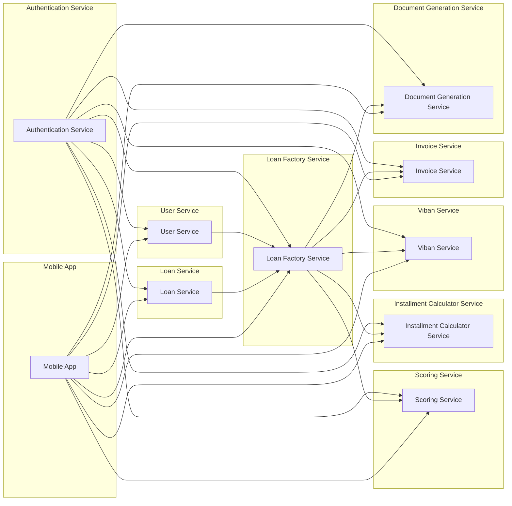

## Microservices Architecture Diagram

**Current Time:** 2023-10-27T10:32:32.487572+00:00

**Author:** Bard

**Diagram:**

**Description:**

* The architecture consists of 9 microservices:
    * **Authentication Service:** Responsible for authentication and authorization of requests.
    * **User Service:** Manages user data.
    * **Loan Service:** Manages loan data.
    * **Loan Factory Service:** Orchestrates the loan application process, interacting with other services.
    * **Scoring Service:** Evaluates loan applications and provides approval decisions.
    * **Installment Calculator Service:** Calculates installment plans based on loan parameters.
    * **Viban Service:** Manages IBANs associated with loans.
    * **Invoice Service:** Manages invoices related to loans.
    * **Document Generation Service:** Generates documents based on templates and data.
* **Mobile App:** A client application that interacts with the microservices.
* **Communication:** Microservices communicate with each other via HTTP requests, using RESTful APIs.
* **Authentication:** The Authentication Service provides access tokens to other services, which are used for authorization.
* **Data Management:** Each microservice manages its own data, typically stored in a separate database.

**Notes:**

* The diagram shows a high-level overview of the architecture.
* The specific implementation details of each microservice are not shown.
* The diagram does not include any external dependencies or infrastructure components.
* The codebase is written in JavaScript and uses Node.js and Express.js.
* The microservices are deployed using Docker and Consul.
* The codebase includes unit tests and end-to-end tests.
* The codebase uses Pact for contract testing.
* The codebase uses Sequelize for database interactions.
* The codebase uses React Native for the mobile app.

**Refactoring Opportunities:**

* **Simplify communication:** Consider using a message queue or event bus for asynchronous communication between microservices.
* **Improve data consistency:** Implement a distributed transaction mechanism to ensure data consistency across multiple microservices.
* **Reduce code duplication:** Extract common functionality into shared libraries.
* **Improve observability:** Implement logging, monitoring, and tracing to gain insights into the system's behavior.
* **Increase resilience:** Implement fault tolerance mechanisms to handle failures gracefully.

**Repo:** thms/microservices-demo

**Further Information:**

* The codebase is available on GitHub: [https://github.com/thms/microservices-demo](https://github.com/thms/microservices-demo)
* The architecture is based on the principles of microservices and domain-driven design.
* The codebase is a good example of how to build a microservices-based application using JavaScript.
